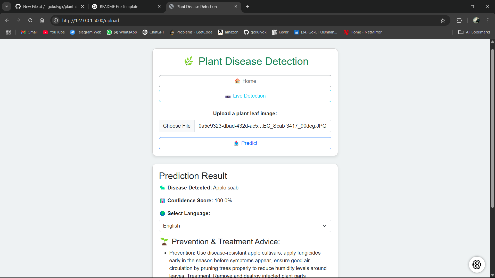

# 🌿 SmartAgro – Plant Health Monitoring via Smartphone

## 🧠 Problem Statement

Plant diseases are one of the main causes of reduced agricultural productivity. Early detection is essential to prevent crop damage and loss. However, many farmers lack access to expert systems for disease identification.

This project aims to provide an AI-powered, image-based tool for detecting plant leaf diseases in real-time using a simple and intuitive interface.

---

## ⚙️ Approach & Solution

We used a Convolutional Neural Network (CNN) trained on a labeled dataset of plant leaf images. The trained model is capable of classifying images into various disease categories.

The application is built using Python with a GUI implemented using `tkinter`. Users can upload a leaf image, and the model predicts the disease class and shows the result within the application.

---

## ✨ Features

- Upload and analyze plant leaf images
- Detects multiple plant diseases
- Simple and responsive Web UI
- Fast and accurate predictions
- Multilingual support

---

## 🛠 Tech Stack

- **Languages:** 
    - HTML
    - CSSS
    - Javascript
    - Python 
- **Frameworks:** 
    - REACT
    - FLASK
- **Model:** 
    - CNN (Keras / TensorFlow-based)  


---

## 📸 Screenshots

  
*Main application interface*

  
*Prediction result after uploading an image*

---

## 🚀 Run Instructions

### ✅ Prerequisites

- Python 3.x
- `pip` installed
- Clone the repository

```bash
git clone https://github.com/gokulvgk/plant-disease-detector.git

cd plant-disease-detector

pip install -r requirements.txt

python app.py

